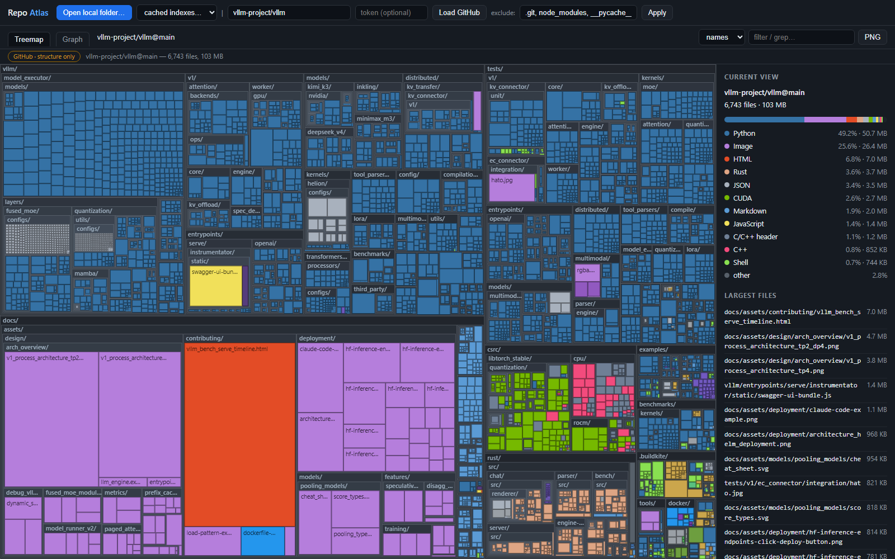
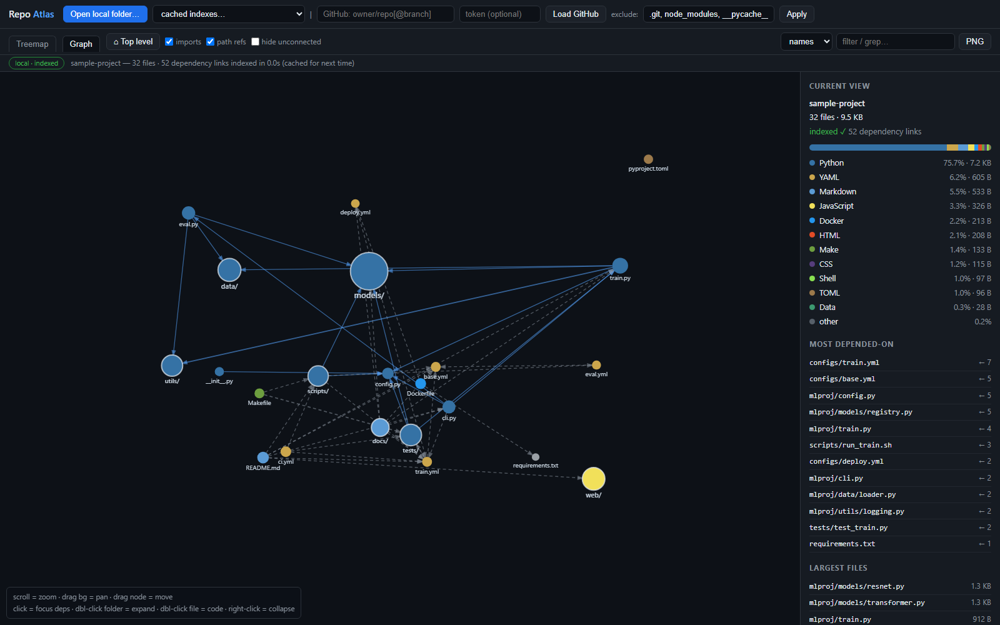
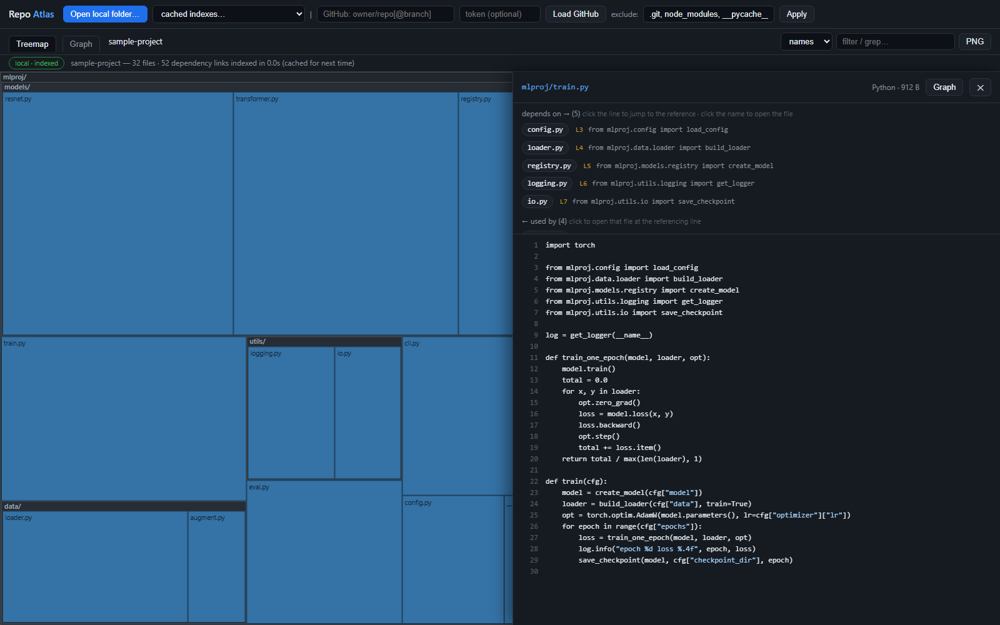
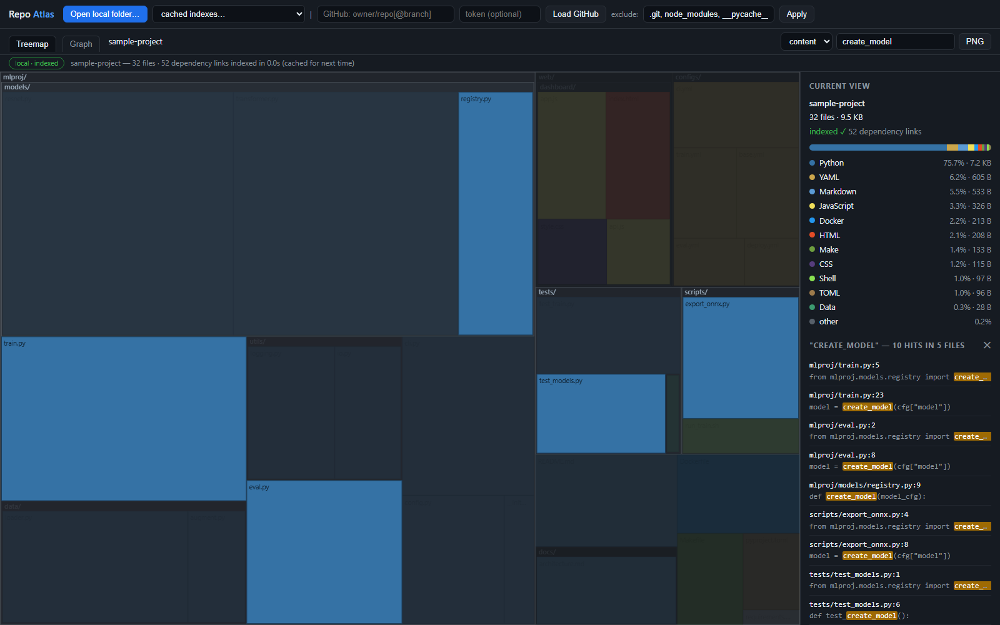

# Repo Atlas

**A single HTML file that helps you get to know a codebase.** Treemap of every file, an interactive dependency graph, instant full-text search, and a built-in code viewer — no install, no server, no upload. Open `repo-atlas.html` in your browser and point it at a folder.

**▶ Use it online: [rajathpi.github.io/repo-atlas](https://rajathpi.github.io/repo-atlas/)** — try the [demo project](https://rajathpi.github.io/repo-atlas/#demo) or [load vLLM's treemap](https://rajathpi.github.io/repo-atlas/#gh=vllm-project/vllm). Local folders are still processed entirely in your browser; nothing is uploaded.

*The entire vLLM repo (6,743 files) loaded straight from the GitHub API — every rectangle is a file, sized by bytes, colored by language.*

## Why

Treemaps tell you *what exists and where the bulk is*, but getting familiar with a codebase is about *relationships*: which files depend on which, what everything ultimately funnels through, and where a config chain like `deploy.yml → train.yml → base.yml` actually connects. Repo Atlas indexes a local folder once (like an IDE would), caches the index in your browser, and then everything — graph, grep, code viewing — is instant.

## Views

### Dependency graph

Built from a real index of your code: **imports** (Python — including `from . import x` — JS/TS relative imports, C/C++/CUDA `#include`) plus **path references** — any file mentioning another file's path or name. That second kind is what catches YAML `include:` chains, CI files invoking scripts, Dockerfiles copying configs, and docs pointing at code.

- Starts folder-level so it's readable; **double-click a folder** to burst it into its contents (children explode out of the parent), **right-click** to collapse
- **Click a node** to focus it — everything unrelated dims, and the sidebar lists what it depends on and what uses it
- **"Most depended-on"** in the sidebar ranks the hub files everyone imports — the fastest way into an unfamiliar codebase; click one for an ego graph of just that file and its neighbors
- Solid blue arrows = imports, dashed gray = path references; both are toggleable, plus *hide unconnected*

### Code viewer with receipts

Click any file anywhere and read it. The panel on top doesn't just list dependencies — it shows **the exact line where each reference happens**, as a clickable snippet. "Depends on" rows jump to the referencing line in this file; "used by" rows open the other file at the line that references this one.

### Instant grep

Once indexed, searching every file's contents is instant: `file:line` hits with highlighted snippets, click to open at that line, and matching files light up in the treemap and graph. The `names` mode live-filters by path instead.

## Getting started

1. Download [`repo-atlas.html`](repo-atlas.html) (one file, zero dependencies)
2. Open it in a browser (Chrome/Edge recommended)
3. Either:
   - **Drop a local folder** on the page (or *Open local folder…*) — indexed once on your machine, cached in the browser for one-click reuse
   - **Load a GitHub repo** by name (`owner/repo`, URL, or `owner/repo@branch`) — structure and treemap only, since the API doesn't provide file contents
   - Hit **▶ Load demo project** to play with a bundled sample

Shareable links work too: `repo-atlas.html#gh=vllm-project/vllm` auto-loads a GitHub repo, `#demo` loads the sample.

## Controls

| Where | Action | Result |
|---|---|---|
| Treemap | click folder / click file / right-click | zoom in / open code / zoom out |
| Graph | scroll / drag background / drag node | zoom / pan / move |
| Graph | click / double-click folder / double-click file / right-click | focus deps / expand / open code / collapse |
| Viewer | click line snippet / click name chip / Esc | jump to reference / open that file / close |
| Search | `names` mode (live) / `content` mode (Enter) | filter by path / grep contents |
| Exclude box | edit + Apply (or Enter) | re-filter in place, no reload |

## Privacy

Local folders never leave your machine — files are read in the browser, the index is stored in your browser's IndexedDB, and there is no server and no telemetry. GitHub mode calls only `api.github.com` (and `raw.githubusercontent.com` when you open a file); an optional token field exists for rate limits and private repos and is never stored.

## Limitations

- Dependency detection is best-effort pattern matching, not a compiler: it resolves what it can find inside the repo, skips external packages, and can miss dynamic imports or aliased paths. Treat a missing edge as "not detected", not "no dependency".
- The path-reference detector counts mentions — a filename in a comment counts (which is often exactly what you want to see).
- GitHub's tree API truncates extremely large repos (>100k files); the status bar warns when that happens.
- Sizes are bytes, not lines of code.

## License

MIT
