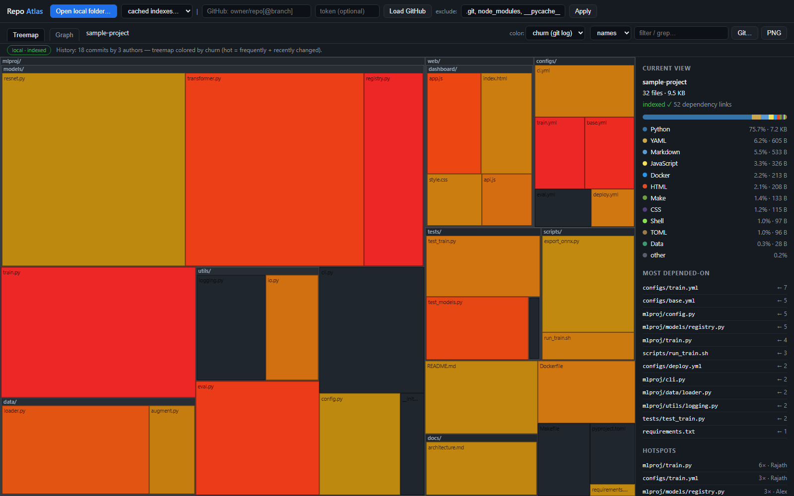
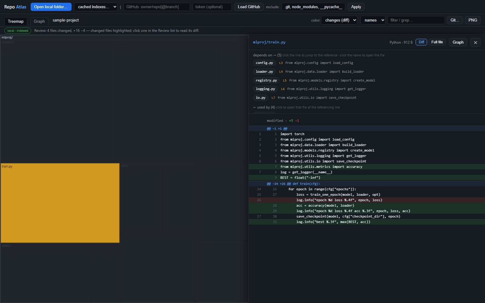

# Repo Atlas

**A single HTML file that helps you get to know a codebase.** Treemap of every file, an interactive dependency graph, instant full-text search, and a built-in code viewer — no install, no server, no upload. Open `repo-atlas.html` in your browser and point it at a folder.

**▶ Use it online: [rajathpi.github.io/repo-atlas](https://rajathpi.github.io/repo-atlas/)** — try the [demo project](https://rajathpi.github.io/repo-atlas/#demo) or [load vLLM's treemap](https://rajathpi.github.io/repo-atlas/#gh=vllm-project/vllm). Local folders are still processed entirely in your browser; nothing is uploaded.


*The entire vLLM repo (6,743 files) loaded straight from the GitHub API — every rectangle is a file, sized by bytes, colored by language.*

## Why

Treemaps tell you *what exists and where the bulk is*, but getting familiar with a codebase is about *relationships*: which files depend on which, what everything ultimately funnels through, and where a config chain like `deploy.yml → train.yml → base.yml` actually connects. Repo Atlas indexes a local folder once (like an IDE would), caches the index in your browser, and then everything — graph, grep, code viewing — is instant.

## Views

### Dependency graph


Built from a real index of your code: **imports** (Python — including `from . import x` — JS/TS relative imports, C/C++/CUDA `#include`) plus **path references** — any file mentioning another file's path or name. That second kind is what catches YAML `include:` chains, CI files invoking scripts, Dockerfiles copying configs, and docs pointing at code.

- **The graph follows the treemap.** Zoom into `services/auth/` on the treemap, switch to Graph, and you get that folder's contents and the links among them — not the whole repo again. The breadcrumb stays visible in both views, so clicking a crumb re-scopes the graph too, and *⌂ Top level* resets both together
- Starts folder-level so it's readable; **double-click a folder** to burst it into its contents (children explode out of the parent), **right-click** to collapse
- **Click a node** to focus it — everything unrelated dims, and the sidebar lists what it depends on and what uses it
- **"Most depended-on"** in the sidebar ranks the hub files everyone imports — the fastest way into an unfamiliar codebase; click one for an ego graph of just that file and its neighbors
- Solid blue arrows = imports, dashed gray = path references; both are toggleable, plus *hide unconnected*

### Code viewer with receipts


Click any file anywhere and read it. The panel on top doesn't just list dependencies — it shows **the exact line where each reference happens**, as a clickable snippet. "Depends on" rows jump to the referencing line in this file; "used by" rows open the other file at the line that references this one.

### Hotspots — "Code as a Crime Scene"



Feed it your git history (`Git…` button has the command — or just drop the output file on the page) and the treemap recolors by **churn**: hot red = changed frequently and recently, dark = untouched. Hot files that are also dependency hubs are where the bugs and the tribal knowledge live. The sidebar adds a ranked **Hotspots** list (with each file's main author) and a **History** feed — recent commits with author and date; click one to light up exactly the files it touched.

### PR / diff review mode



Reviewing changes without context is the worst part of reviewing. Load a diff — `git diff main` for a local branch (including what an AI assistant just edited), a `.diff` file, or **fetch any GitHub PR by number** (there's also a "Merged PRs…" browser) — and:

- Changed files light up **on the treemap**, so you see where each change lives and what surrounds it
- The **Review list** shows every file with `A/M/D/R` status and +/− counts; click to read the diff, with a **Full file** tab one click away
- The dependency panel still works on changed files, and one checkbox extends the highlight to **direct dependents** — the change's blast radius

### Instant grep


Once indexed, searching every file's contents is instant: `file:line` hits with highlighted snippets, click to open at that line, and matching files light up in the treemap and graph. The `names` mode live-filters by path instead.

## Getting started

1. Download [`repo-atlas.html`](repo-atlas.html) (one file, zero dependencies)
2. Open it in a browser (Chrome/Edge recommended)
3. Either:
   - **Drop a local folder** on the page (or *Open local folder…*) — indexed once on your machine, cached in the browser for one-click reuse. Excluded folders like `.git` and `node_modules` are never opened, so a 20,000-file repo indexes in a few seconds
   - **Load a GitHub repo** by name (`owner/repo`, URL, or `owner/repo@branch`) — structure and treemap only, since the API doesn't provide file contents
   - Hit **▶ Load demo project** to play with a bundled sample

Shareable links work too: `repo-atlas.html#gh=vllm-project/vllm` auto-loads a GitHub repo, `#demo` loads the sample (`#demo-graph`, `#demo-hotspots`, `#demo-review`, `#demo-grep` jump straight to each view).

For git features, the fastest path needs no files at all: in the `Git…` dialog hit **▶ copy & run** — it copies the command and watches your clipboard, so after you run it in a terminal the output loads by itself when you switch back to the tab:

```
git log --numstat --date=short --no-color -n 5000 | clip    # hotspots + history   (macOS: | pbcopy)
git diff main --no-color | clip                             # review mode
```

Or skip the terminal entirely: when the loaded folder's git origin is on GitHub (or the repo was loaded from GitHub), the `Git…` dialog detects it and offers **Fetch history from GitHub** — one click for hotspots and the commit feed (recent commits; add a token to fetch more). Redirected files (`> gitlog.txt`) dropped on the page also work, in any encoding — PowerShell's UTF-16 included.

## Controls

| Where | Action | Result |
|---|---|---|
| Treemap | click folder / click file / right-click | zoom in / open code / zoom out |
| Breadcrumb | click a crumb | zoom there — and re-scope the graph to match |
| Graph | scroll / drag background / drag node | zoom / pan / move |
| Graph | click / double-click folder / double-click file / right-click | focus deps / expand / open code / collapse |
| Viewer | click line snippet / click name chip / Esc | jump to reference / open that file / close |
| Search | `names` mode (live) / `content` mode (Enter) | filter by path / grep contents |
| Exclude box | edit + Apply (or Enter) | re-filter in place, no reload |

## Speed

Indexing is a single pass over the text in your folder, so it scales with how much
source there is rather than how big the checkout is. Local clones, Chrome on an
Apple M5 Max:

| Repo | Files indexed | Text | Index time |
|---|---|---|---|
| `huggingface/trl` | 608 | 9 MB | 0.3 s |
| `vllm-project/vllm` | 6,634 | 70 MB | 3.0 s |
| `sgl-project/sglang` | 8,097 | 88 MB | 3.8 s |
| a 17k-file firmware monorepo | 16,956 | 208 MB | 4.1 s |
| a 20k-file docs monorepo | 20,652 | 285 MB | 7.0 s |

Excluded folders are skipped during the scan rather than filtered afterwards, so
`.git`, `node_modules` and friends cost nothing at all — that 20k-file repo is
35,000 files on disk. The UI keeps painting throughout: the indexer hands the main
thread back on a time budget, so no single pause exceeds ~70 ms, apart from one
bookkeeping step when the folder first loads (a third of a second on the 20k-file
repo, proportionally less below that).

Everything after indexing is interactive rather than batched: on that same 20k-file
repo, grepping all 285 MB takes 37 ms, zooming the treemap 13 ms, and the dependency
graph lays out at under 2 ms per frame.

## Privacy

Local folders never leave your machine — files are read in the browser, the index is stored in your browser's IndexedDB, and there is no server and no telemetry. GitHub mode calls only `api.github.com` (and `raw.githubusercontent.com` when you open a file); an optional token field exists for rate limits and private repos and is never stored.

## Limitations

- Dependency detection is best-effort pattern matching, not a compiler: it resolves what it can find inside the repo, skips external packages, and can miss dynamic imports or aliased paths. Treat a missing edge as "not detected", not "no dependency".
- The path-reference detector counts mentions — a filename in a comment counts (which is often exactly what you want to see).
- GitHub's tree API truncates extremely large repos (>100k files); the status bar warns when that happens.
- Sizes are bytes, not lines of code.
- Excluded folders are skipped during the scan, so they cost nothing — but that also means loosening the exclude list re-scans the folder rather than filtering what was already read.
- Above ~80 MB of text, the browser cache keeps the index (treemap and graph) but not file contents; re-open the folder to grep or read code. Re-indexing a large repo takes a few seconds anyway.
- The graph draws at most 500 nodes at a time; past that it shows the largest and tells you, since a denser graph is unreadable and slow to lay out. Zoom into a subfolder on the treemap to see the rest.

## License

MIT
